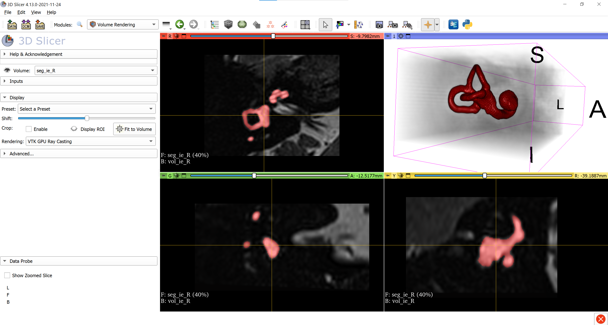

# IEVNet

**Powered by:**

</br>


This is the official repository for our IEVnet publication ([Open-access paper and PDF](https://doi.org/10.3389/fneur.2022.663200)). If you make use of the training/inference code or the pre-trained model weights in this repository, please cite our work appropriately ([How-to-cite](#citation)).  It includes MONAI code for IEVnet training and inference on cropped volumes around inner ears (for details regarding input data format, please refer to the publication). Please note that unfortunately, the dataset for training can not be shared in full due to lack of patient consent. However, we provide two sample volumes for inference in the subfolder `./sample_data`. We also provide the pre-trained IEVNet model weights which was used to create the validation in our publication. There are two ways to run inference with IEVnet - either in a [docker container (recommended)](#running-ievnet-in-a-docker-image-recommended) or in a [local installation](#running-ievnet-locally) of MONAI. The instructions below instructions assume Linux (e.g. Ubuntu) as your operating system. If you are running a Windows system, it is recommended to install the [Windows Subsystem for Linux (WSL2)](https://docs.microsoft.com/en-us/windows/wsl/install).

# Installation
Please clone this repository to your local hard drive into a local folder (e.g. /my/code/) via: 

```bash
cd /my/code
git clone https://github.com/pydsgz/IEVNet.git
cd IEVNet
```

## Running IEVnet in a docker image (recommended)
The best way to run IEVnet is via a docker container, to make sure that all necessary packages are installed in the correct version. We are going to use Project MONAI's official image for this, specifically version `projectmonai/monai:0.3.0rc4`. Make sure that docker is installed on your system ([Ubuntu installation instructions](https://docs.docker.com/engine/install/ubuntu/), for other Linux distributions, please follow according instructions).

Assuming that you have navigated to the folder of the git repository (e.g. `/my/code/IEVNet` in the above example), you can start the docker container by running:
```
myuser@workstation:/my/code/IEVNet# . start_docker.sh
```
This will map the git repository to the folder `/ievnet/` within the docker container, and expose port 9995 to be able to start jupyter notebooks. Please navigate to the folder `/ievnet` within the docker container. You can query the usage syntax for the inference script 
```
root@9b1a4a590da9:/ievnet# python ievnet_infer.py -h
```
This yields the following usage manual:
```
usage: ievnet_infer.py [-h] --filenames_in FILENAMES_IN [FILENAMES_IN ...]
                       --filenames_out FILENAMES_OUT [FILENAMES_OUT ...]
                       [--device {cpu,cuda}]

Program for IEVnet inference.

optional arguments:
  -h, --help            show this help message and exit
  --filenames_in FILENAMES_IN [FILENAMES_IN ...]
                        Filepath(s) to inner ear volumes (crops). Assumes
                        input and writes output volumes of dimensions
                        [200,150,100] at 0.2mm resolution. Several filepaths
                        are separated with a single space.
  --filenames_out FILENAMES_OUT [FILENAMES_OUT ...]
                        Output filepath(s) to inner ear segmentations. Will be
                        written as .nii.gz volumes of dimensions [200,150,100]
                        at 0.2mm resolution. Several filepaths are separated
                        with a single space.
  --device {cpu,cuda}   Device for inference. Can be "cpu" or "cuda" (i.e.
                        GPU).
```
For the provided sample data, you can run the convenience script:
```
root@9b1a4a590da9:/ievnet/IEVNet# . sample_run.sh
```

It calls `ievnet_infer.py` on the two provided sample volumes as follows:
```
python ./ievnet_infer.py \
    --filenames_in  ./sample_data/vol_ie_L.nii.gz ./sample_data/vol_ie_R.nii.gz \
    --filenames_out ./sample_data/seg_ie_L.nii.gz ./sample_data/seg_ie_R.nii.gz
```
Afterwards, you can load the sample volumes and IEVnet inference results (segmentations) into the Nifti viewer of your choice. We recommend to download and install [3D Slicer](https://download.slicer.org/). Please note that for volume and segmentation maps to overlap in Slicer, the segmentations need to be transformed from IJK to RAS coordinate system. The repository contains a transform file `IJKtoRAS.h5` which can be used in Slicer to make the segmentation overlap correctly with the volume. If everything went correctly, your visualization should look similar to this:



## Running IEVnet locally
An alternative is to install MONAI locally and run IEVnet on bare metal. Please follow MONAI installation instructions. It is recommended to install MONAI in a [python virtual environment](https://docs.python.org/3/tutorial/venv.html) or in a [conda environment](https://docs.conda.io/projects/conda/en/latest/user-guide/tasks/manage-environments.html). Please make sure that your local environment resembles as closely to the following package versions as possible (ideally, also install jupyter lab/notebook). In particular, please install MONAI in version 0.3.0rc4. Once the correct versions are installed, feel free to start a jupyter lab/notebook server, and run inference in the notebook `jnb_Monai_IEVnet_02mm_infer_newcases.ipynb`.

```
MONAI version: 0.3.0rc4
Python version: 3.6.10 |Anaconda, Inc.| (default, May  8 2020, 02:54:21)  [GCC 7.3.0]
OS version: Linux (4.15.0-144-generic)
Numpy version: 1.19.1
Pytorch version: 1.7.0a0+8deb4fe
MONAI flags: HAS_EXT = False, USE_COMPILED = False

Optional dependencies:
Pytorch Ignite version: 0.4.2
Nibabel version: 3.1.1
scikit-image version: 0.15.0
Pillow version: 7.2.0
Tensorboard version: 1.15.0+nv
gdown version: 3.12.2
TorchVision version: 0.8.0a0
ITK version: 5.1.1
tqdm version: 4.50.0

For details about installing the optional dependencies, please visit:
    https://docs.monai.io/en/latest/installation.html#installing-the-recommended-dependencies
```

# Citation
**Please cite this work as:**

Ahmadi, S.-A., Frei, J., Vivar, G., Dieterich, M., & Kirsch, V. (2022). _IE-Vnet: Deep Learning-Based Segmentation of the Inner Ear’s Total Fluid Space._ In Frontiers in Neurology (Vol. 13). Frontiers Media SA. https://doi.org/10.3389/fneur.2022.663200

**BibTex:**
```
@ARTICLE{10.3389/fneur.2022.663200,
AUTHOR={Ahmadi, Seyed-Ahmad and Frei, Johann and Vivar, Gerome and Dieterich, Marianne and Kirsch, Valerie},   
TITLE={IE-Vnet: Deep Learning-Based Segmentation of the Inner Ear's Total Fluid Space},      
JOURNAL={Frontiers in Neurology},      
VOLUME={13},      
YEAR={2022},      
URL={https://www.frontiersin.org/article/10.3389/fneur.2022.663200},       
DOI={10.3389/fneur.2022.663200},      
ISSN={1664-2295},   
}
```
